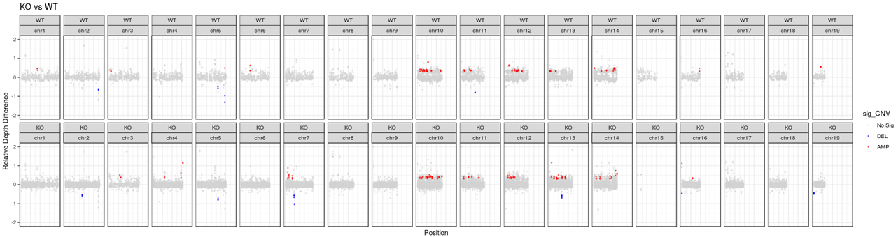
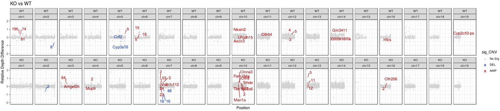
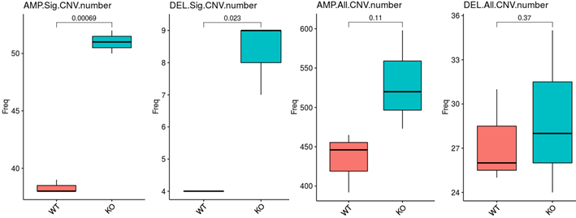

# step1 . Alignment

This page showed the alignment of WGS for mouse data.

~~~shell
####reference and software
mm10=/mnt/data/user_data/xiangyu/8922_server/programme/genome_index/GATK/GATK_REFER/bundle/mm10/dbsnp/dbsnp
GENOME=/mnt/data/user_data/xiangyu/8922_server/programme/genome_index/bwa_index/bwa_mm10_index/genome.fa
GATK=/mnt/data/user_data/xiangyu/programme/gatk-4.1.3.0/gatk

####outpath for genomics
BAMOUT=/mnt/data/userdata/abao/project/4_whole_genome_sequencing/1_Lishujun/other/
SNVOUT=$BAMOUT/snv_out
mkdir $SNVOUT

####sample list
vim samplelist
33_2R /mnt/data/sequencedata/whole-genome_sequencing/Mki67/ANYWSC180111_PM-YWSC180111-01_AH5MFMDSXX_2018-12-01/Cleandata/33-2R/33-2R
33_B /mnt/data/sequencedata/whole-genome_sequencing/Mki67/ANYWSC180111_PM-YWSC180111-01_AH5MFMDSXX_2018-12-01/Cleandata/33-B/33-B
33_L /mnt/data/sequencedata/whole-genome_sequencing/Mki67/ANYWSC180111_PM-YWSC180111-01_AH5MFMDSXX_2018-12-01/Cleandata/33-L/33-L
35_B /mnt/data/sequencedata/whole-genome_sequencing/Mki67/ANYWSC180111_PM-YWSC180111-01_AH5MFMDSXX_2018-12-01/Cleandata/35-B/35-B
35_L /mnt/data/sequencedata/whole-genome_sequencing/Mki67/ANYWSC180111_PM-YWSC180111-01_AH5MFMDSXX_2018-12-01/Cleandata/35-L/35-L
35_N /mnt/data/sequencedata/whole-genome_sequencing/Mki67/ANYWSC180111_PM-YWSC180111-01_AH5MFMDSXX_2018-12-01/Cleandata/35-N/35-N

####execute codes
cat samplelist | while read id ; do
arr=($id)
fq2=${arr[1]}'_R1.fq.gz'
fq1=${arr[1]}'_R2.fq.gz'
sample=${arr[0]}
echo ${fq2}
echo ${fq1}
echo $sample
bwa mem -t 30 -M  -R "@RG\tID:$sample\tSM:$sample\tLB:WGS\tPL:Illumina" $GENOME $fq1 $fq2 > $BAMOUT/$sample.sam
$GATK  --java-options "-Xmx60G -Djava.io.tmpdir=./"  SortSam -SO coordinate  -I $BAMOUT/$sample.sam -O $BAMOUT/$sample.sort.bam > $BAMOUT/$sample.log.sort	
$GATK  --java-options "-Xmx60G -Djava.io.tmpdir=./"  MarkDuplicates \
-I $BAMOUT/$sample.sort.bam \
-O $BAMOUT/${sample}_marked.bam \
-REMOVE_DUPLICATES=true \
-M $BAMOUT/$sample.metrics 1> $BAMOUT/$sample.log.mark  2>&1 
rm -r $BAMOUT/$sample.sam ;
done
~~~

# step2 . SNV detected by Mutect2

~~~shell

####execute codes
cat samplelist | while read id ; do
arr=($id)
fq2=${arr[1]}'_R1.fq.gz'
fq1=${arr[1]}'_R2.fq.gz'
sample=${arr[0]}
echo ${fq2}
echo ${fq1}
echo $sample
$GATK --java-options "-Xmx100G -Djava.io.tmpdir=./" FixMateInformation \
-I $BAMOUT/${sample}_marked.bam \
-O $BAMOUT/${sample}_fix.bam \
-SO coordinate --CREATE_INDEX true 

$GATK --java-options "-Xmx100G -Djava.io.tmpdir=./" BaseRecalibrator \
-R $GENOME -I $BAMOUT/${sample}_fix.bam \
--known-sites $mm10/mm10.INDELS.dbSNP142.vcf \
--known-sites $mm10/mm10.dbSNP142.vcf \
-O $BAMOUT/$sample.wes.recal_data.table

$GATK --java-options "-Xmx100G -Djava.io.tmpdir=./" ApplyBQSR \
-R $GENOME -I $BAMOUT/${sample}_fix.bam \
-bqsr $BAMOUT/$sample.wes.recal_data.table \
-O $BAMOUT/${sample}_BQSR.bam 

$GATK --java-options "-Xmx100G -Djava.io.tmpdir=./" Mutect2 \
-R $GENOME \
-I $BAMOUT/${sample}_BQSR.bam \
-O $SNVOUT/$sample.Mutect2only_tumor.vcf.gz ;
done

~~~

# step3. SNV annotated by vep and maf files generated

~~~shell
####execute codes
cat samplelist | while read id ; do
arr=($id)
tumor_name=${arr[0]}
echo $tumor_name
gunzip $tumor_name.Mutect2only_tumor.vcf.gz
perl /mnt/data/userdata/xiangyu/programme/vcf2maf-master/vcf2maf.pl \
--input-vcf $SNVOUT/$tumor_name.Mutect2only_tumor.vcf \
--output-maf $SNVOUT/$tumor_name.Mutect2only_tumor.vep.maf \
--tumor-id $tumor_name \
--vcf-tumor-id $tumor_name \
--ref-fasta /mnt/data/userdata/xiangyu/programme/genome_index/bwa_index/bwa_mm10_index/genome.fa \
--vep-path /mnt/data/userdata/xiangyu/programme/ensembl-vep-release-95.3/vep_all \
--vep-data /mnt/data/userdata/xiangyu/programme/ensembl-vep-release-95.3/vep_all/.vep \
--vep-forks 40 --species mus_musculus --species mus_musculus --ncbi-build GRCm38 ;
done
~~~

# step4. CNV called by cnvkit (for individual samples)

~~~shell
####reference and software
refFlat=/mnt/data/userdata/xiangyu/programme/genome_index/bwa_index/bwa_mm10_index/refFlat.txt
GENOME=/mnt/data/userdata/xiangyu/programme/genome_index/bwa_index/bwa_mm10_index/genome.fa
extend_tools=/mnt/data/userdata/xiangyu/programme/R_PACKAGES/my_code/CNV_pipeline/
CNVKIT=/mnt/data/userdata/xiangyu/programme/cnvkit-0.9.9/cnvkit.py
PROCESSES=50
parameter='-1.3,-0.4,0.3,0.9'
ratio=0.4

####outpath for genomics
BAMOUT=/mnt/data/userdata/abao/project/4_whole_genome_sequencing/1_Lishujun/other
CNVOUT=$BAMOUT/cnvkit_out
mkdir $CNVOUT
rm_XY_out=$CNVOUT/rm_XY
all_chr_out=$CNVOUT/all_chr
mkdir $rm_XY_out
mkdir $all_chr_out

cat samplelist | while read id ; do
arr=($id)
sample=${arr[0]}
echo $sample
####execute codes
##=============== call batch to WGS ===============##
$CNVKIT batch $BAMOUT/${sample}_marked.bam -m wgs -f $GENOME -n -p $PROCESSES --output-reference $CNVOUT/$sample.cnn \
--segment-method hmm --target-avg-size 1000 --drop-low-coverage --output-dir $CNVOUT --annotate $refFlat
# default bin >10kb
# cutoff probe >10
# chromosome      start   end     gene    log2    depth   probes  weight
perl -ne '@F=split/\t/; $probe=$F[6]; $len=$F[2]-$F[1]; if($.==1){print}elsif($probe>10 && $len>1000){print}' $CNVOUT/${sample}_marked.call.cns > $CNVOUT/$sample.filtered.cns ;
done
~~~

## 4.1 The coverage of X/Y always too slow to detect, consequently, following analysis had removed the XY chromosome for flowing analysis 

~~~shell
####execute codes
cat samplelist | while read id ; do
arr=($id)
sample=${arr[0]}
echo $sample
# chr1-22 (XY also removed because it had low accuracy)
perl -ne 'print if (/^chr\d+/ || /^chromosome/ || /^\d+/)' $CNVOUT/${sample}_marked.cnr > $rm_XY_out/$sample.rmXY.cnr
perl -ne 'print if (/^chr\d+/ || /^chromosome/ || /^\d+/)' $CNVOUT/$sample.filtered.cns > $rm_XY_out/$sample.rmXY.cns
##=============== Add absolute CN ===============##
$CNVKIT call $rm_XY_out/$sample.rmXY.cns -m threshold -t=${parameter} -o $rm_XY_out/$sample.rmXY.call.cns
##=============== Plot cn pattern ===============##
# *.rmXY.cns      # all of cnv is yellow color
# *.rmXY.call.cns   # only abnormal cnv is yellow color
$CNVKIT scatter $rm_XY_out/$sample.rmXY.cnr -s $rm_XY_out/$sample.rmXY.call.cns --y-min -4 --y-max 4 -w 10000000 -o $rm_XY_out/$sample.rmXY.call.cns.pdf
##=============== Gene-level ===============##
# call genelevel cnv
#https://cnvkit.readthedocs.io/en/stable/reports.html
# use *.call.rmXY.cns
$CNVKIT genemetrics $rm_XY_out/$sample.rmXY.cnr > $rm_XY_out/$sample.ratio_gene.rmXY.raw.tsv
$CNVKIT genemetrics $rm_XY_out/$sample.rmXY.cnr -s $rm_XY_out/$sample.rmXY.call.cns -t ${ratio} -m 5 > $rm_XY_out/$sample.segment_gene.rmXY.raw.tsv
sed '1d' $rm_XY_out/$sample.ratio_gene.rmXY.raw.tsv | cut -f 1 | sort -u > $rm_XY_out/$sample.ratio_gene.gene
sed '1d' $rm_XY_out/$sample.segment_gene.rmXY.raw.tsv | cut -f 1 | sort -u > $rm_XY_out/$sample.segment_gene.gene
comm -12 $rm_XY_out/$sample.ratio_gene.gene $rm_XY_out/$sample.segment_gene.gene > $rm_XY_out/$sample.trusted-genes.txt
Rscript $extend_tools/extract_and_filter_Scripts --l=$rm_XY_out/$sample.trusted-genes.txt --m=$rm_XY_out/$sample.segment_gene.rmXY.raw.tsv --c=gene --o=$rm_XY_out/$sample.segment_gene.trusted.gainloss.rmXY.tsv
# remove process files
rm -f $rm_XY_out/genome.*bed $rm_XY_out/$sample.*targetcoverage.cnn $rm_XY_out/$sample.ratio_gene.gene $rm_XY_out/$sample.segment_gene.gene $rm_XY_out/$sample.*.tmp
rm -f $rm_XY_out/$sample.*.filtered.cns $rm_XY_out/$sample.*.ratio_gene.trusted.gainloss.tsv $rm_XY_out/$sample.*trusted-genes.txt $rm_XY_out/$sample.segment_gene.rmXY.raw.tsv ;
done
~~~

## 4.2 This part includes all chromosome data for flowing analysis 

~~~shell
####execute codes
cat samplelist | while read id ; do
arr=($id)
sample=${arr[0]}
echo $sample
# chr1-22 (KEEP XY)
##=============== Add absolute CN ===============##
$CNVKIT call $CNVOUT/$sample.filtered.cns -m threshold -t=${parameter} -o $all_chr_out/$sample.allChr.call.cns
##=============== Plot cn pattern ===============##
# *.allChr.cns      # all of cnv is yellow color
# *.allChr.call.cns   # only abnormal cnv is yellow color
$CNVKIT scatter $CNVOUT/${sample}_marked.cnr -s $all_chr_out/$sample.allChr.call.cns --y-min -4 --y-max 4 -w 10000000 -o $all_chr_out/$sample.allChr.call.cns.pdf
##=============== Gene-level ===============##
# call genelevel cnv
#https://cnvkit.readthedocs.io/en/stable/reports.html
# use *.call.allChr.cns
$CNVKIT genemetrics $CNVOUT/${sample}_marked.cnr > $all_chr_out/$sample.ratio_gene.allChr.raw.tsv
$CNVKIT genemetrics $CNVOUT/${sample}_marked.cnr -s $all_chr_out/$sample.allChr.call.cns -t ${ratio} -m 5 > $all_chr_out/$sample.segment_gene.allChr.raw.tsv
sed '1d' $all_chr_out/$sample.ratio_gene.allChr.raw.tsv | cut -f 1 | sort -u > $all_chr_out/$sample.ratio_gene.gene
sed '1d' $all_chr_out/$sample.segment_gene.allChr.raw.tsv | cut -f 1 | sort -u > $all_chr_out/$sample.segment_gene.gene
comm -12 $all_chr_out/$sample.ratio_gene.gene $all_chr_out/$sample.segment_gene.gene > $all_chr_out/$sample.trusted-genes.txt
Rscript $extend_tools/extract_and_filter_Scripts --l=$all_chr_out/$sample.trusted-genes.txt --m=$all_chr_out/$sample.segment_gene.allChr.raw.tsv --c=gene --o=$all_chr_out/$sample.segment_gene.trusted.gainloss.allChr.tsv
# remove process files
rm -f $all_chr_out/genome.*bed $all_chr_out/$sample.*targetcoverage.cnn $all_chr_out/$sample.ratio_gene.gene $all_chr_out/$sample.segment_gene.gene $all_chr_out/$sample.*.tmp
rm -f $all_chr_out/$sample.*.filtered.cns $all_chr_out/$sample.*.ratio_gene.trusted.gainloss.tsv $all_chr_out/$sample.*trusted-genes.txt $all_chr_out/$sample.segment_gene.allChr.raw.tsv ;
done
~~~

## 4.3 merge all individual results

~~~shell
Rscript $extend_tools/merge_cnvkit_res_Scripts --call_cns=$rm_XY_out --out_cns=$rm_XY_out --seg_gene=$rm_XY_out --out_seg=$rm_XY_out --prefix=all_merge
Rscript $extend_tools/merge_cnvkit_res_Scripts --call_cns=$all_chr_out --out_cns=$all_chr_out --seg_gene=$all_chr_out --out_seg=$all_chr_out --prefix=all_merge
~~~

## 4.4 visualize the global CNV map in all samples

~~~R
####reference and software
CNVKIT=/mnt/data/userdata/xiangyu/programme/cnvkit-0.9.9/cnvkit.py
BAMOUT=/mnt/data/userdata/abao/project/4_whole_genome_sequencing/1_Lishujun/other
CNVOUT=$BAMOUT/cnvkit_out
mkdir $CNVOUT
rm_XY_out=$CNVOUT/rm_XY
all_chr_out=$CNVOUT/all_chr

####execute codes
$CNVKIT heatmap $rm_XY_out/*.rmXY.call.cns \
-d -o $rm_XY_out/all_merge_rm_XY_CNV_heatmap.pdf

$CNVKIT heatmap $all_chr_out/*.allChr.call.cns \
-d -o $all_chr_out/all_merge_all_chr_CNV_heatmap.pdf
~~~

# step5. visualize the CNV results in R

## 5.1 global CNV visualize in all samples

~~~R
library(ggplot2)
library(data.table)
library(viridis)
library(scales)
library(readr)
all_merge_call_copy <- fread("/mnt/data/userdata/abao/project/4_whole_genome_sequencing/1_Lishujun/other/cnvkit_out/rm_XY/all_merge_merge.call.cns")
all_merge_call_copy1 <- as.data.frame(all_merge_call_copy)
all_merge_call_copy1$cn_status <- "AMP"
all_merge_call_copy1[all_merge_call_copy1$cn<2,]$cn_status <- "DEL"
all_merge_call_copy1[all_merge_call_copy1$cn==2,]$cn_status <- "ROH"
all_merge_call_copy1$cn_status <- factor(all_merge_call_copy1$cn_status, levels=c("AMP","ROH","DEL"))
all_merge_call_copy1$chromosome <- factor(all_merge_call_copy1$chromosome, levels=c("chr1","chr2","chr3","chr4","chr5","chr6",
	"chr7","chr8","chr9","chr10","chr11","chr12","chr13","chr14","chr15","chr16","chr17","chr18","chr19"))
all_merge_call_copy1 <- all_merge_call_copy1[order(all_merge_call_copy1$chromosome,all_merge_call_copy1$start,all_merge_call_copy1$end),]
range(all_merge_call_copy1$log2)
all_merge_call_copy1[all_merge_call_copy1$log2 > 2,]$log2 <- 2
if (length(all_merge_call_copy1[all_merge_call_copy1$log2 < -2,]$log2)>0) {
	all_merge_call_copy1[all_merge_call_copy1$log2 < -2,]$log2 <- -2
}
# create the plot
sample <- unique(all_merge_call_copy1$sample)
All_plot <- lapply(1:length(sample),function(x) {
	plot <- ggplot(subset(all_merge_call_copy1,sample==sample[x]), aes(x=start, y=log2, color=cn_status)) + 
	geom_point(size=.5,alpha=.5) + scale_color_manual(values=c("#A30000", "lightgrey", "#002EB8")) + theme_bw() +
    ylab("Relative Depth Difference") + xlab("Position")+ylim(-2,2) + labs(title=gsub(".rmXY","",sample[x])) + 
    facet_wrap(~chromosome,nrow=1)+   theme(axis.ticks.x = element_blank(), axis.text.x = element_blank())
    return(plot)
	})
plot <- Seurat::CombinePlots(All_plot,ncol=1)
ggsave("/mnt/data/userdata/abao/project/4_whole_genome_sequencing/1_Lishujun/other/cnvkit_out/rm_XY/all_somatic_CNV_plot_each_sample.png", plot=plot,dpi=1080,width = 20, height = 10.6)
~~~

~~~R

library(GenVisR)
all_merge_call_copy1$new_group <- ifelse(all_merge_call_copy1$sample=="35_N.rmXY" | all_merge_call_copy1$sample=="35_L.rmXY" | all_merge_call_copy1$sample=="35_B.rmXY","KO","WT")
all_merge_call_copy1_genvisr <- all_merge_call_copy1[,c("chromosome","start","end","probes","log2","new_group")]
colnames(all_merge_call_copy1_genvisr) <- c("chromosome", "start", "end", "probes", "segmean", "sample")
cnFreq(subset(all_merge_call_copy1_genvisr,sample=="WT"),
   CN_low_cutoff = -0.4,   CN_high_cutoff = 0.3,  plot_title = "All CNV in WT",
   CN_Loss_colour = "#002EB8",   CN_Gain_colour = "#A30000",   x_title_size = 12,
   y_title_size = 12,   facet_lab_size = 10,   plotLayer = NULL,
   plotType = "proportion",   genome = "mm10",out = "plot",
   plotChr = c("chr1","chr2","chr3","chr4","chr5","chr6","chr7","chr8","chr9","chr10","chr11","chr12","chr13","chr14","chr15","chr16","chr17","chr18","chr19"))

cnFreq(subset(all_merge_call_copy1_genvisr,sample=="KO"),
   CN_low_cutoff = -0.4,   CN_high_cutoff = 0.3,  plot_title = "All CNV in KO",
   CN_Loss_colour = "#002EB8",   CN_Gain_colour = "#A30000",   x_title_size = 12,
   y_title_size = 12,   facet_lab_size = 10,   plotLayer = NULL,
   plotType = "proportion",   genome = "mm10",out = "plot",
   plotChr = c("chr1","chr2","chr3","chr4","chr5","chr6","chr7","chr8","chr9","chr10","chr11","chr12","chr13","chr14","chr15","chr16","chr17","chr18","chr19"))
~~~

## 5.2 sig CNV detected (***strict filtered, occurred in all case/control group, receptively***)  

~~~R
library(GenomicRanges)
library(future)
library(future.apply)
options(future.globals.maxSize = 300 * 1024^3)
plan("multiprocess", workers = 15)
plan()
XY_subset <- function(data,colnames,sel_chr){
  sel_chr <- intersect(unique(as.character(sel_chr)),unique(as.character(data[,colnames])))
  tmp <- future_lapply(sel_chr,function(x){
    new_tmp <- data[which(data[,colnames]==x),]
    return(new_tmp)
    })
  all_sub <- do.call(rbind,tmp)
  head(all_sub)
  return(all_sub)
}
all_merge_call_copy1$sample <- as.character(all_merge_call_copy1$sample)
MKI76_KO <- XY_subset(all_merge_call_copy1,"sample",c("35_N.rmXY","35_L.rmXY","35_B.rmXY"))
MKI76_WT <- XY_subset(all_merge_call_copy1,"sample",c("33_B.rmXY","33_L.rmXY","33_2R.rmXY"))

MKI76_KO_sig_CNV <- subset(MKI76_KO,log2 > 0.3 | log2 < -0.4)
MKI76_WT_sig_CNV <- subset(MKI76_WT,log2 > 0.3 | log2 < -0.4)
MKI76_KO_sig_CNV <- subset(MKI76_KO_sig_CNV,p_ttest < 0.05)
MKI76_WT_sig_CNV <- subset(MKI76_WT_sig_CNV,p_ttest < 0.05)

MKI76_KO_gr <- lapply(unique(MKI76_KO_sig_CNV$sample),function(x) {
	tmp <- GenomicRanges::makeGRangesFromDataFrame(subset(MKI76_KO_sig_CNV,sample==x), keep.extra.columns = FALSE)
	return(tmp)
	})
MKI76_KO_common_gr <- MKI76_KO_gr[[1]][MKI76_KO_gr[[1]] %over% MKI76_KO_gr[[2]]]
MKI76_KO_common_gr <- MKI76_KO_common_gr[MKI76_KO_common_gr %over% MKI76_KO_gr[[3]]]

MKI76_WT_gr <- lapply(unique(MKI76_WT_sig_CNV$sample),function(x) {
	tmp <- GenomicRanges::makeGRangesFromDataFrame(subset(MKI76_WT_sig_CNV,sample==x), keep.extra.columns = FALSE)
	return(tmp)
	})
MKI76_WT_common_gr <- MKI76_WT_gr[[1]][MKI76_WT_gr[[1]] %over% MKI76_WT_gr[[2]]]
MKI76_WT_common_gr <- MKI76_WT_common_gr[MKI76_WT_common_gr %over% MKI76_WT_gr[[3]]]

table(MKI76_KO_common_gr %over% MKI76_WT_common_gr)
MKI76_KO_spe_gr <- MKI76_KO_common_gr[!MKI76_KO_common_gr %over% MKI76_WT_common_gr]
MKI76_WT_spe_gr <- MKI76_WT_common_gr[!MKI76_WT_common_gr %over% MKI76_KO_common_gr]
table(MKI76_KO_spe_gr %over% MKI76_WT_spe_gr)

MKI76_KO_spe_ <- lapply(unique(MKI76_KO_sig_CNV$sample),function(x) {
	tmp <- GenomicRanges::makeGRangesFromDataFrame(subset(MKI76_KO_sig_CNV,sample==x), keep.extra.columns = TRUE)
	tmp1 <- tmp[tmp %over% MKI76_KO_spe_gr]
	tmp1 <- as.data.frame(tmp1)
	return(tmp1)
	})
MKI76_KO_spe <- do.call(rbind,MKI76_KO_spe_)
MKI76_WT_spe_ <- lapply(unique(MKI76_WT_sig_CNV$sample),function(x) {
	tmp <- GenomicRanges::makeGRangesFromDataFrame(subset(MKI76_WT_sig_CNV,sample==x), keep.extra.columns = TRUE)
	tmp1 <- tmp[tmp %over% MKI76_WT_spe_gr]
	tmp1 <- as.data.frame(tmp1)
	return(tmp1)
	})
MKI76_WT_spe <- do.call(rbind,MKI76_WT_spe_)
All_DCNVs <- rbind(MKI76_KO_spe,MKI76_WT_spe)
All_DCNVs$cn_status <- factor(All_DCNVs$cn_status, levels=c("AMP","DEL"))
All_DCNVs$seqnames <- as.character(All_DCNVs$seqnames)
All_DCNVs$seqnames <- factor(All_DCNVs$seqnames, levels=unique(All_DCNVs$seqnames))
All_DCNVs <- All_DCNVs[order(All_DCNVs$seqnames,All_DCNVs$start,All_DCNVs$end),]
sample <- unique(All_DCNVs$sample)
All_plot <- lapply(1:length(sample),function(x) {
	plot <- ggplot(subset(All_DCNVs,sample==sample[x]), aes(x=start, y=log2, color=cn_status)) + 
	geom_point(size=.5,alpha=.5) + scale_color_manual(values=c("#A30000", "#002EB8")) + theme_bw() +
    ylab("Relative Depth Difference") + xlab("Position")+ylim(-2,2) + labs(title=gsub(".rmXY","",sample[x])) + 
    facet_wrap(~seqnames,nrow=1)+   theme(axis.ticks.x = element_blank(), axis.text.x = element_blank())
    return(plot)
	})
plot <- Seurat::CombinePlots(All_plot,ncol=1)
ggsave("/mnt/data/userdata/abao/project/4_whole_genome_sequencing/1_Lishujun/other/cnvkit_out/rm_XY/Strict_all_DCNV_plot_each_sample.png", plot=plot,dpi=1080,width = 20, height = 10.6)
~~~

~~~R
library(GenVisR)
All_DCNVs$new_group <- ifelse(All_DCNVs$sample=="35_N.rmXY" | All_DCNVs$sample=="35_L.rmXY" | All_DCNVs$sample=="35_B.rmXY","KO","WT")
All_DCNVs_genvisr <- All_DCNVs[,c("seqnames","start","end","probes","log2","new_group")]
colnames(All_DCNVs_genvisr) <- c("chromosome", "start", "end", "probes", "segmean", "sample")
cnFreq(subset(All_DCNVs_genvisr,sample=="WT"),
   CN_low_cutoff = -0.4,   CN_high_cutoff = 0.3,  plot_title = "sig. Common CNV in WT",
   CN_Loss_colour = "#002EB8",   CN_Gain_colour = "#A30000",   x_title_size = 12,
   y_title_size = 12,   facet_lab_size = 10,   plotLayer = NULL,
   plotType = "proportion",   genome = "mm10",out = "plot",
   plotChr = c("chr1","chr2","chr3","chr4","chr5","chr6","chr7","chr8","chr9","chr10","chr11","chr12","chr13","chr14","chr15","chr16","chr17","chr18","chr19"))

cnFreq(subset(All_DCNVs_genvisr,sample=="KO"),
   CN_low_cutoff = -0.4,   CN_high_cutoff = 0.3,  plot_title = "sig. Common CNV in KO",
   CN_Loss_colour = "#002EB8",   CN_Gain_colour = "#A30000",   x_title_size = 12,
   y_title_size = 12,   facet_lab_size = 10,   plotLayer = NULL,
   plotType = "proportion",   genome = "mm10",out = "plot",
   plotChr = c("chr1","chr2","chr3","chr4","chr5","chr6","chr7","chr8","chr9","chr10","chr11","chr12","chr13","chr14","chr15","chr16","chr17","chr18","chr19"))
~~~

~~~R
all_merge_call_copy <- fread("/mnt/data/userdata/abao/project/4_whole_genome_sequencing/1_Lishujun/other/cnvkit_out/rm_XY/all_merge_merge.call.cns")
all_merge_call_copy1 <- as.data.frame(all_merge_call_copy)
all_merge_call_copy1$cn_status <- "AMP"
all_merge_call_copy1[all_merge_call_copy1$cn<2,]$cn_status <- "DEL"
all_merge_call_copy1[all_merge_call_copy1$cn==2,]$cn_status <- "ROH"
all_merge_call_copy1$cn_status <- factor(all_merge_call_copy1$cn_status, levels=c("AMP","ROH","DEL"))
all_merge_call_copy1$chromosome <- factor(all_merge_call_copy1$chromosome, levels=c("chr1","chr2","chr3","chr4","chr5","chr6",
	"chr7","chr8","chr9","chr10","chr11","chr12","chr13","chr14","chr15","chr16","chr17","chr18","chr19"))
all_merge_call_copy1 <- all_merge_call_copy1[order(all_merge_call_copy1$chromosome,all_merge_call_copy1$start,all_merge_call_copy1$end),]
range(all_merge_call_copy1$log2)
all_merge_call_copy1[all_merge_call_copy1$log2 > 2,]$log2 <- 2
if (length(all_merge_call_copy1[all_merge_call_copy1$log2 < -2,]$log2)>0) {
	all_merge_call_copy1[all_merge_call_copy1$log2 < -2,]$log2 <- -2
}

All_DCNVs$seg_ids <- paste(All_DCNVs$seqnames,All_DCNVs$start,All_DCNVs$end,All_DCNVs$sample)
rownames(All_DCNVs) <- All_DCNVs$seg_ids
all_merge_call_copy1$seg_ids <- paste(all_merge_call_copy1$chromosome,all_merge_call_copy1$start,all_merge_call_copy1$end,all_merge_call_copy1$sample)
rownames(all_merge_call_copy1) <- all_merge_call_copy1$seg_ids
all_merge_call_copy1$sig_CNV <- "No.Sig"
all_merge_call_copy1[rownames(All_DCNVs),]$sig_CNV <- as.character(All_DCNVs$cn_status)
all_merge_call_copy1$sig_CNV <- factor(all_merge_call_copy1$sig_CNV, levels=c("No.Sig","DEL","AMP"))
all_merge_call_copy1$new_group <- ifelse(all_merge_call_copy1$sample=="35_N.rmXY" | all_merge_call_copy1$sample=="35_L.rmXY" | all_merge_call_copy1$sample=="35_B.rmXY","KO","WT")
all_merge_call_copy1$new_group <- factor(all_merge_call_copy1$new_group,levels=c("WT","KO"))
all_merge_call_copy1$chromosome <- factor(all_merge_call_copy1$chromosome, levels=c("chr1","chr2","chr3","chr4","chr5","chr6",
	"chr7","chr8","chr9","chr10","chr11","chr12","chr13","chr14","chr15","chr16","chr17","chr18","chr19"))
all_merge_call_copy1 <- all_merge_call_copy1[order(all_merge_call_copy1$sig_CNV,all_merge_call_copy1$chromosome,all_merge_call_copy1$start,all_merge_call_copy1$end),]
range(all_merge_call_copy1$log2)
ggplot(all_merge_call_copy1, aes(x=start, y=log2, color=sig_CNV)) + 
	geom_point(size=.5,alpha=.5) + scale_color_manual(values=c("lightgrey","#002EB8","#A30000")) + theme_bw() +
    ylab("Relative Depth Difference") + xlab("Position")+ylim(-2,2) + labs(title="KO vs WT") + 
    facet_wrap(~new_group+chromosome,nrow=2)+   theme(axis.ticks.x = element_blank(), axis.text.x = element_blank())
trqwe::mcsaveRDS(all_merge_call_copy1,"/mnt/data/userdata/abao/project/4_whole_genome_sequencing/1_Lishujun/other/cnvkit_out/rm_XY/all_merge_merge.call_with_sig_anno.rds")
~~~

## 5.3 Highlight the gene regulated by sig CNV (***strict filtered, occurred in all case/control group, receptively***)  

~~~R

all_merge_call_copy1 <- trqwe::mcreadRDS("/mnt/data/userdata/abao/project/4_whole_genome_sequencing/1_Lishujun/other/cnvkit_out/rm_XY/all_merge_merge.call_with_sig_anno.rds")
sig_CNV <- subset(all_merge_call_copy1,sig_CNV!="No.Sig")
CNV_genes <- unique(unlist(strsplit(sig_CNV$gene,split=",")))
CNV_genes <- setdiff(CNV_genes,"-")

sig_CNV_extract <- sig_CNV[sig_CNV[,"gene"]%in%CNV_genes,]
dup_genes <- names(table(sig_CNV_extract$gene))[table(sig_CNV_extract$gene)>1]
tmp_all_ <- lapply(dup_genes,function(x) {
  tmp <- subset(sig_CNV_extract,gene==x)
  tmp$length <- tmp$end-tmp$start
  max_length <- tmp$length[tmp$length==max(tmp$length)]
  if (length(max_length)==1){
    tmp1 <- subset(tmp,length==max_length)
    tmp1 <- tmp1[,-ncol(tmp1)]
  } else {
    tmp1 <- subset(tmp,weight==max(tmp$weight))
    tmp1 <- tmp1[,-ncol(tmp1)]
  }
  return(tmp1)
  })
dup_matrix <- do.call(rbind,tmp_all_)
matrix_extract_uni <- sig_CNV[sig_CNV[,"gene"]%in%names(table(sig_CNV$gene))[table(sig_CNV$gene)==1],]
matrix_extract_uni <- rbind(matrix_extract_uni,dup_matrix)
All_cnv_data <- rbind(matrix_extract_uni,subset(all_merge_call_copy1,sig_CNV=="No.Sig"))

All_cnv_data$new_gene <- All_cnv_data$gene
All_cnv_data$new_gene <- unlist(lapply(strsplit(All_cnv_data$gene,split=","),function(x) {
  return(length(x))
}))
All_cnv_data[All_cnv_data$new_gene==1,]$new_gene <- All_cnv_data[All_cnv_data$new_gene==1,]$gene

library(ggrepel)
ggplot(All_cnv_data, aes(x=start, y=log2, color=sig_CNV)) + 
  geom_point(size=.5,alpha=.5) + scale_color_manual(values=c("lightgrey","#002EB8","#A30000")) + theme_bw() +
    ylab("Relative Depth Difference") + xlab("Position")+ylim(-2,2) + labs(title="KO vs WT") + 
    facet_wrap(~new_group+chromosome,nrow=2)+   theme(axis.ticks.x = element_blank(), axis.text.x = element_blank()) +
geom_text_repel(
  data = subset(All_cnv_data,sig_CNV!="No.Sig" & gene!="-"),
  aes(label = new_gene),
  size = 4,
  box.padding = unit(0.35, "lines"),
  point.padding = unit(0.3, "lines")
)
~~~

## 5.4 Summary of the CNV number in case/control samples

~~~R
all_merge_call_copy1 <- trqwe::mcreadRDS("/mnt/data/userdata/abao/project/4_whole_genome_sequencing/1_Lishujun/other/cnvkit_out/rm_XY/all_merge_merge.call_with_sig_anno.rds")
sig_CNV <- subset(all_merge_call_copy1,sig_CNV!="No.Sig")
All_Freq <- as.data.frame(table(sig_CNV$sample,sig_CNV$cn_status))
All_Freq$new_group <- ifelse(All_Freq$Var1=="35_N.rmXY" | All_Freq$Var1=="35_L.rmXY" | All_Freq$Var1=="35_B.rmXY","KO","WT")
library(ggpubr)
library(cowplot)
p1 <- ggboxplot(subset(All_Freq,Var2=="AMP"), x = "new_group", y = "Freq", fill="new_group",
  title=c("AMP.Sig.CNV.number"), legend = "none",outlier.shape = NA,notch = FALSE) +
  rotate_x_text(angle = 45)+ stat_compare_means(comparisons =list(c("WT","KO")),
    method = "t.test",paired=TRUE)
p2 <- ggboxplot(subset(All_Freq,Var2=="DEL"), x = "new_group", y = "Freq", fill="new_group",
  title=c("DEL.Sig.CNV.number"), legend = "none",outlier.shape = NA,notch = FALSE) +
  rotate_x_text(angle = 45)+ stat_compare_means(comparisons =list(c("WT","KO")),
    method = "t.test",paired=TRUE)
plot_grid(p1,p2)
All_Freq <- as.data.frame(table(all_merge_call_copy1$sample,all_merge_call_copy1$cn_status))
All_Freq$new_group <- ifelse(All_Freq$Var1=="35_N.rmXY" | All_Freq$Var1=="35_L.rmXY" | All_Freq$Var1=="35_B.rmXY","KO","WT")
library(ggpubr)
library(cowplot)
p1 <- ggboxplot(subset(All_Freq,Var2=="AMP"), x = "new_group", y = "Freq", fill="new_group",
  title=c("AMP.All.CNV.number"), legend = "none",outlier.shape = NA,notch = FALSE) +
  rotate_x_text(angle = 45)+ stat_compare_means(comparisons =list(c("WT","KO")),
    method = "t.test",paired=TRUE)
p2 <- ggboxplot(subset(All_Freq,Var2=="DEL"), x = "new_group", y = "Freq", fill="new_group",
  title=c("DEL.All.CNV.number"), legend = "none",outlier.shape = NA,notch = FALSE) +
  rotate_x_text(angle = 45)+ stat_compare_means(comparisons =list(c("WT","KO")),
    method = "t.test",paired=TRUE)
plot_grid(p1,p2)
~~~

